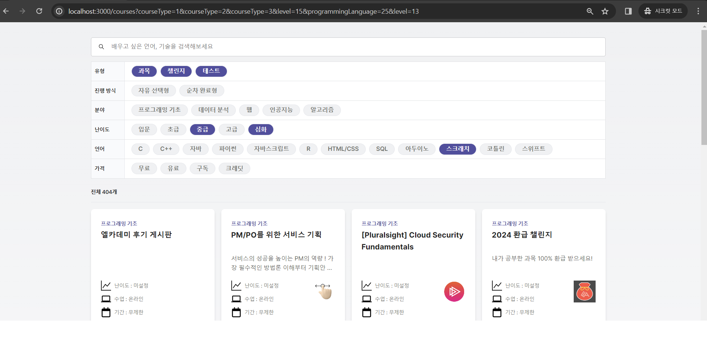

# Elice FrontEnd PA

### 프로젝트 설명

Elice 프론트엔드 PA로 엘리스 웹 서비스의 일부인 과목 검색의 간소화 버전을 구현해보는 과제.

### Writer: 숭실대학교 소프트웨어학부 조승효

- contact: seunghyo7742@naver.com

### 실행방법

- Node.js 18.17 버전 이상
- 로컬 환경 실행

```sh
git clone https://github.com/Joseunghyo7742/elice-frontend-PA.git
cd search-pa
npm install
npm run dev
```

- [localhost:3000](http://localhost:3000/courses) 페이지 이동: 홈 화면은 비워두었습니다.

### 사용 기술

- 개발 환경: Next.js, React, Typescript, TailwindCSS, Fetch
- Next.js 13버전으로 App router방식으로 구현했습니다.

### git 규칙

- git commization 사용하여 커밋메시지를 관리할 수 있도록 하였습니다.
- .cz-config.js에서 commit 규칙 확인 및 수정 가능합니다.
- 사용방법
  ```sh
    git add .
    npx cz
  ```
- npx cz -> 커밋 타입 선택 -> 제목 작성 -> 커밋에 대한 상세내용 본문에 작성 (다음 줄에 넘길 때 | 사용) -> 작성된 내용 확인 후 y or n 입력
- commit 후 기존 github 사용법 대로 push 를 진행하시면 됩니다.

### 결과 화면 및 구현 내용




#### 1. UI 구현 완료사항

- 빠른 구현을 위해 Tailwind CSS를 사용하여 과제를 진행했습니다.
- Layout 요구 사항대로 구현 완료
- SearchArea (SearchInput 컴포넌트)로 구현 완료. debounced hook을 만들었으나 Next 서버 API 연동에 실패하여 결과물을 보여주지 못하였습니다.
- Filter (SearchFilter & Chip 컴포넌트)로 UI를 화면처럼 구현하였습니다.
- CourseCard 내 Label, Title, Body, Description, IconText, Logo 를 요구사항대로 구현했습니다.
- enroll_type과 course.is_free 값에 따라 label표기를 명확히 하였습니다.

#### 2. url Query 적용

- 브라우저를 새로고침하여도 선택된 필터가 유지될 수 있도록 구현하였습니다.

```js
function Chip({ keyNum, value, name, queryCategory }: Props) {
  const searchParams = useSearchParams();
  const router = useRouter();
  const isActive = searchParams.getAll(queryCategory).includes(keyNum);
  const keyword = searchParams.get('keyword');

  const toggleIsActive = async () => {
    const params = new URLSearchParams(searchParams);
    const currentParams = params.getAll(queryCategory);
    if (currentParams.includes(keyNum)) {
      params.delete(queryCategory, keyNum);
    } else {
      params.append(queryCategory, keyNum);
    }
    router.push(`/courses/?${params.toString()}`);
  }
```
- Chip 컴포넌트를 통해 사용자의 필터링을 선택을 처리하고 `SearchFilter` 컴포넌트를 사용해 전체 필터링 옵션을 렌더링합니다. 
- `useSearchParams` 를 이용해 현재 URL의 쿼리 파라미터를 관리하며, 사용자가 옵션을 클릭할 때마다 `Router.push`를 사용해 URL을 업데이트합니다.
- 이를 통해 필터링 상태를 URL에 동기화 시킵니다.
- api/constants.ts 내에 실제 사이트의 url params처럼 번호로 넘어갈 수 있도록 맵핑 상수를 만들었습니다.

#### 3. Next.js API [Route Handler](https://nextjs.org/docs/app/building-your-application/routing/route-handlers)를 활용한 API서버 구현

- Next.js 서버 단에서 API 요청을 하여 CORS 문제를 해결하였습니다.
- 필터와 검색 키워드는 반영하지 못하였으나 CourseList 컴포넌트에서 필수 Params인 count와 offset을 파라미터로 넣어 서버로 API요청 하도록 구현했습니다.
- 공식문서와 [영상을 참고](https://www.youtube.com/watch?v=xirQ7AMyTM8&t=881s)하여 구현했습니다

#### 4. eslint, prettier 설정

- eslint와 prettier를 설정하여 코드 규칙을 유지할 수 있도록 하였습니다.
- `eslint-config-prettier` : prettier 설치와 함께 eslint와 충돌날 수 있으니 eslint-config-prettier도 함께 설치
- `eslint-plugin-import --save-dev`: import 구문 정렬을 위함
- `eslint-plugin-prettier`: 코드 내 prettier 에러를 lint에러로 보고하도록 하는 플러그인
- `eslint-plugin-tailwindcss`: tailwind className 정렬을 위함

#### 5. 파일 구조

```
search-pa
├─ .cz-config.js
├─ .eslintrc.json
├─ .gitignore
├─ .prettierrc
├─ next.config.mjs
├─ package-lock.json
├─ package.json
├─ postcss.config.js
├─ public
│  ├─ next.svg
│  └─ vercel.svg
├─ README.md
├─ src
│  ├─ app
│  │  ├─ api
│  │  │  ├─ constants.ts
│  │  │  ├─ courses
│  │  │  │  └─ route.ts
│  │  │  └─ types.ts
│  │  ├─ courses
│  │  │  └─ page.tsx
│  │  ├─ globals.css
│  │  ├─ layout.tsx
│  │  └─ page.tsx
│  ├─ components
│  │  ├─ CourseCard.tsx
│  │  ├─ CourseList.tsx
│  │  ├─ Pagenation.tsx
│  │  ├─ SearchFilter
│  │  │  ├─ Chip.tsx
│  │  │  └─ SearchFilter.tsx
│  │  └─ SearchInput.tsx
│  └─ hooks
│     └─ useDebounce.ts
├─ tailwind.config.ts
└─ tsconfig.json
```

